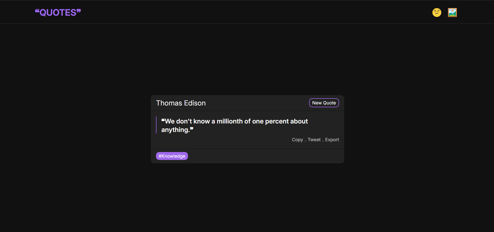
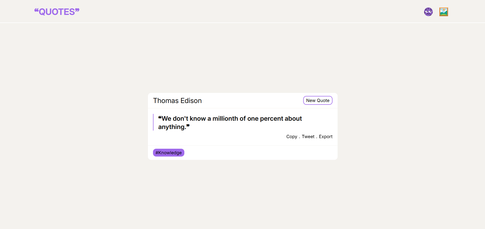

# ❝QUOTES❞

A simple and fun web application that provides random quotes with interactive features such as sharing on Twitter, copying to clipboard, changing themes, and exporting the quote as an image.

## Features

1. **Fetch Random Quote**  
   Retrieves a random quote from an API and displays it with the author's name and related tags.

2. **Copy to Clipboard**  
   Allows users to copy the quote to their clipboard with a "Copy" button.

3. **Share to Twitter**  
   Share the quote directly to Twitter with a pre-filled tweet including the quote text and its tags.

4. **Dark/Light Theme Toggle**  
   Switches between a dark and light theme with a single click.

5. **Random Background Gradient**  
   Changes the background to a random gradient each time the button is pressed.

6. **Export Quote as Image**  
   Allows users to export the displayed quote as an image file.

## Screenshots

Here are some screenshots of the application in both dark and light themes:

### Dark Theme:

### Light Theme:

## Deployment

You can access the live application [here](https://chuchrahimanshu.github.io/quotes.github.io/).

## Technologies Used

- HTML
- CSS
- JavaScript
- [HTML2Canvas](https://cdnjs.cloudflare.com/ajax/libs/html2canvas/1.4.1/html2canvas.min.js) (for exporting the quote as an image)
- [API Source](https://api.freeapi.app/api/v1/public/quotes/quote/random) (for fetching random quotes)
